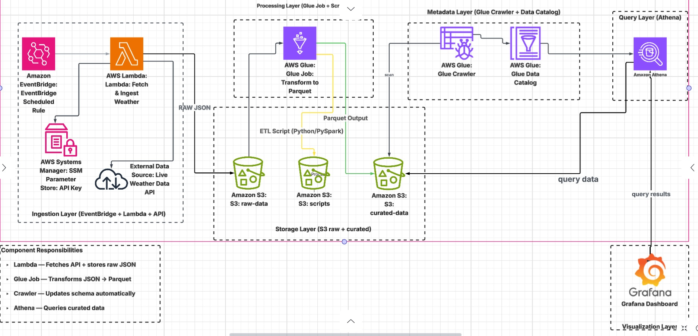
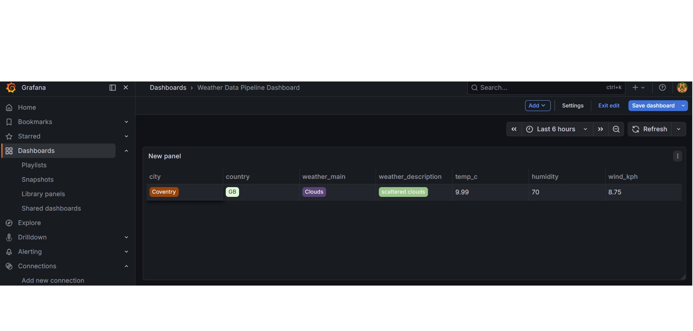

# ☁️ AWS Serverless Weather Data Pipeline

[](https://gitlab.com/Toga-Labs/weather-pipeline/-/commits/main)

## 📌 Overview
A professional, event-driven ETL pipeline built on AWS using **Modular Terraform**. This project automates the ingestion of live weather data into a multi-tier S3 Data Lake, transforms raw JSON into analytics-optimized Parquet using AWS Glue, and visualizes insights via Grafana.

---

## 🏗️ Architecture Diagram

*Serverless ETL flow with secure parameter management and modular infrastructure.*

---

## 🛠️ Infrastructure & DevOps (Terraform)

### 1. Remote State & Locking
To ensure infrastructure consistency and enable secure team collaboration, this project uses a **Remote Backend**:
*   **S3 Bucket:** Stores the `terraform.tfstate` file securely.
*   **DynamoDB Table:** Handles **State Locking** to prevent concurrent executions and state corruption during GitLab CI/CD runs.

### 2. Modular Design
The infrastructure is decoupled into reusable modules for scalability and clean separation of concerns:
*   **`modules/lambda_ingestion`**: Handles API ingestion logic and automated zip packaging.
*   **`modules/glue_job` & `modules/glue_crawler_*`**: Manages the ETL transformation and schema discovery.
*   **`modules/s3`**: Defines the Data Lake storage layers (Raw vs. Curated).
*   **`modules/iam`**: Implements **Least-Privilege** access control across all services.

### 3. Automated Lambda Packaging
The project uses Terraform's `archive_file` data source to automatically bundle the Python source code into a `lambda.zip` during deployment. This ensures that the latest code is always uploaded whenever the infrastructure is updated.

---

## 👷 CI/CD Pipeline (GitLab)
The project utilizes a robust 3-stage automated pipeline to ensure infrastructure stability:

1.  **Validate:** Runs `terraform fmt` and `terraform validate` to ensure code quality.
2.  **Plan:** Executes `terraform plan` and saves the output as a **Plan Artifact (`tfplan`)**.
3.  **Apply:** Deploys the infrastructure using the specific `tfplan` artifact to ensure only inspected changes are applied.

> **Production Guardrail:** A `destroy` stage is intentionally omitted from the pipeline to prevent accidental deletion of production data and infrastructure.

---

## 🚀 The Data Journey
1.  **Ingestion:** `EventBridge` triggers the `Lambda` function on a schedule.
2.  **Security:** Lambda fetches the API key from **SSM Parameter Store** and saves raw JSON to `S3: raw-data`.
3.  **ETL:** `AWS Glue` executes a PySpark script to convert data to **Apache Parquet**.
4.  **Cataloging:** `Glue Crawlers` update the `Data Catalog` for both raw and curated datasets.
5.  **Visualization:** `Athena` queries the curated data for a live **Grafana** dashboard.

---

## 📊 Dashboard Preview

*Live visualization of temperature, humidity, and wind speed queried via Amazon Athena.*

---

## 🔍 Proof of Implementation
> [!TIP]
> To view the full technical implementation (AWS Console screenshots of Lambda code, Glue tables, S3 partitions, and SQL queries), please visit the [**/images/ folder**](./images/).

---

## 📂 Project Structure
```text
.
├── modules/                  # Modular Infrastructure Components
│   ├── athena/
│   ├── eventbridge/
│   ├── glue_crawler_curated/
│   ├── glue_crawler_raw/
│   ├── glue_job/
│   ├── iam/
│   ├── lambda_ingestion/     # Python Source + Zip Artifact
│   └── s3/
├── etl_scripts/              # PySpark Transformation Logic
│   └── weather_etl.py
├── images/                   # Architecture Diagrams & Screenshots
├── backend.tf                # S3 Backend & DynamoDB Locking
├── main.tf                   # Root Module
├── providers.tf              # AWS Provider Configuration
├── terraform.tfvars          # Environment Variables (Local)

```
can you make the one beleow header
🚀 Future Roadmap
*   **Multi-City Ingestion:** Scale the Lambda function to fetch data for multiple global locations in parallel.
*   **SNS Alerts:** Integrate **Amazon SNS** to trigger email notifications when specific weather thresholds (e.g., extreme heat) are met.
---
